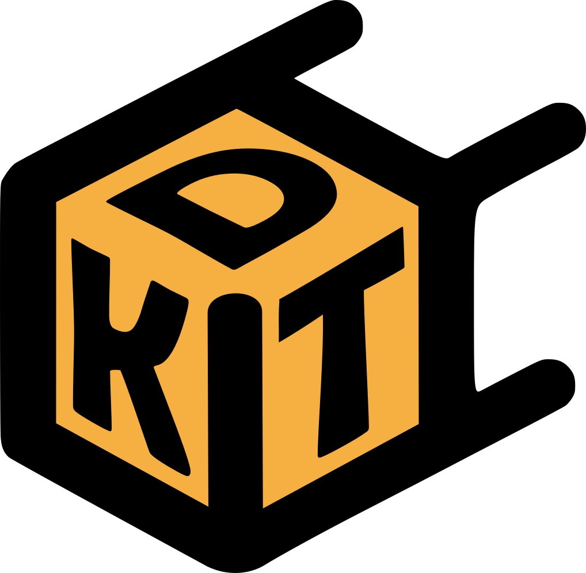

# KDT 🚀

---
## 📋 Requisitos previos
- PHP 8.1+
- Composer 
- MySQL
- Node.js & npm

---
## ⚡ Instalación
- Clonar el respositorio
- Instalar dependencias php (composer install)
- configurar archivo .ENV
- Migrar base de datos y ejecutar Seeders (php artisan migrate:fresh --seed)
- Levantar servidor (php artisan serve)

---

